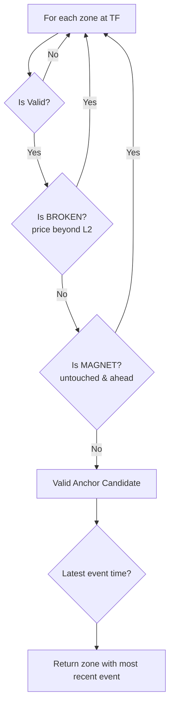
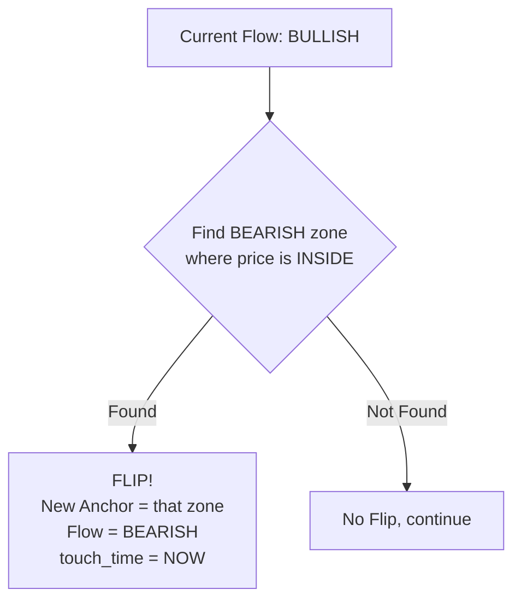
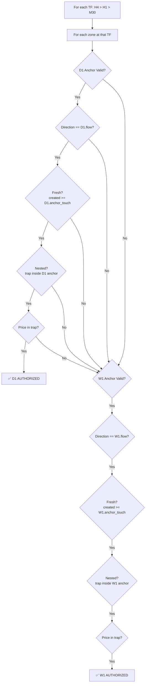

# Comprehensive Analysis: Fractal Flow Logic

> **Document Version:** V1.7  
> **Last Updated:** 2026-02-06  
> **Source File:** [StrategyOrchestrator.mqh](file:///c:/Users/User/Desktop/SIGMA%20System%20Anti%20Gravity/MQL5/Include/V5.0/Trading/StrategyOrchestrator.mqh)

---

## PART 1: Anchor + Magnet Zones (L1-L2 & Flipping)

### L1 and L2 Semantics

| Field | Meaning | Example (BULLISH) | Example (BEARISH) |
|-------|---------|-------------------|-------------------|
| **L1** | Entry Price (P2 from 5-pointer) | 1580 (zone top) | 1620 (zone top) |
| **L2** | Invalidation Price (stop side) | 1575 (below L1) | 1625 (above L1) |

> [!IMPORTANT]
> L1 and L2 do NOT have consistent directional meaning. For BULLISH zones, L1 > L2. For BEARISH zones, L1 < L2. This is why V1.7 uses `MathMax/MathMin` for direction-agnostic bounds.

---

### FindAnchor Logic

**Location:** [FindAnchor](file:///c:/Users/User/Desktop/SIGMA%20System%20Anti%20Gravity/MQL5/Include/V5.0/Trading/StrategyOrchestrator.mqh#L337-L370)



| Check | BULLISH Zone | BEARISH Zone |
|-------|--------------|--------------|
| **Broken** | `price < L2` | `price > L2` |
| **Ahead (Magnet)** | `price > L1` | `price < L1` |

---

### Flipping Logic (CheckTouchFlip)

**Location:** [CheckTouchFlip](file:///c:/Users/User/Desktop/SIGMA%20System%20Anti%20Gravity/MQL5/Include/V5.0/Trading/StrategyOrchestrator.mqh#L289-L332)



| Current Flow | Looking For | Inside Check |
|--------------|-------------|--------------|
| BULLISH | BEARISH zones | `price >= L1 && price <= L2` |
| BEARISH | BULLISH zones | `price <= L1 && price >= L2` |

---

## PART 2: Fresh Trap Zone Detection (ScanTraps)

**Location:** [ScanTraps](file:///c:/Users/User/Desktop/SIGMA%20System%20Anti%20Gravity/MQL5/Include/V5.0/Trading/StrategyOrchestrator.mqh#L413-L531)

### Trap Authorization Flow



### The 4 Authorization Gates

| Gate | Check | V1.7 Status |
|------|-------|-------------|
| **1. Direction Match** | `zone.direction == flow` | ✅ Correct |
| **2. Freshness** | `zone_created_time >= anchor_touch_time` | ✅ Correct |
| **3. Nesting** | `trap_top <= anchor_top && trap_bot >= anchor_bot` | ✅ Fixed in V1.7 |
| **4. Price-In-Trap** | `price <= trap_top && price >= trap_bot` | ✅ Fixed in V1.7 |

### V1.7 Direction-Agnostic Bounds Fix

```cpp
// BEFORE (BROKEN - direction-specific):
inside = (anchor.direction == DIRECTION_BULLISH)
   ? (trap.L1 <= anchor.L1 && trap.L2 >= anchor.L2)
   : (trap.L1 >= anchor.L1 && trap.L2 <= anchor.L2);

// AFTER (CORRECT - direction-agnostic):
double trap_top = MathMax(trap.L1, trap.L2);
double trap_bot = MathMin(trap.L1, trap.L2);
double anchor_top = MathMax(anchor.L1, anchor.L2);
double anchor_bot = MathMin(anchor.L1, anchor.L2);

bool inside = (trap_top <= anchor_top && trap_bot >= anchor_bot);
```

---

## PART 3: SL and TP Calculation

**Location:** [IsTradeAllowed](file:///c:/Users/User/Desktop/SIGMA%20System%20Anti%20Gravity/MQL5/Include/V5.0/Trading/StrategyOrchestrator.mqh#L536-L601)

### Stop Loss

```cpp
if(signal_dir == DIRECTION_BULLISH)
   out_sl = trigger_zone.L2_price - (InpSLBufferPoints * _Point);
else
   out_sl = trigger_zone.L2_price + (InpSLBufferPoints * _Point);
```

| Direction | SL Calculation | Logic |
|-----------|----------------|-------|
| **BUY** | `L2 - buffer` | L2 is below entry, go below for invalidation |
| **SELL** | `L2 + buffer` | L2 is above entry, go above for invalidation |

### Take Profit

**Option A: Magnet-Based TP** (when `InpUseFixedTarget = false` and magnet exists)
```cpp
out_tp = zones[magnet].L1_price;
```

**Option B: Fixed R TP** (fallback or when `InpUseFixedTarget = true`)
```cpp
double risk_dist = MathAbs(trigger_zone.L1_price - out_sl);
out_tp = (signal_dir == DIRECTION_BULLISH) 
   ? (trigger_zone.L1_price + (risk_dist * InpTarget_R))
   : (trigger_zone.L1_price - (risk_dist * InpTarget_R));
```

---

## Known Issues & Recommendations

### Issue 1: Inconsistent "Inside" Check in CheckTouchFlip

> [!WARNING]
> The flip logic uses direction-specific L1/L2, which is inconsistent with V1.7's nesting fix.

**Location:** Lines 306-311
```cpp
if(zones[i].direction == DIRECTION_BULLISH)
   inside = (current_price <= zones[i].L1_price && current_price >= zones[i].L2_price);
else
   inside = (current_price >= zones[i].L1_price && current_price <= zones[i].L2_price);
```

**Recommendation:** Unify to use `MathMax/MathMin` pattern.

### Issue 2: ClassifyFlow also has inconsistent "inside" check

**Location:** Lines 249-253

**Recommendation:** Apply same V1.7 fix pattern for consistency.

---

## Version History

| Version | Date | Changes |
|---------|------|---------|
| V1.1 | 2026-02-06 | Fresh Trap + Any-Zone Flip |
| V1.2 | 2026-02-06 | Critical Flip Check Bug Fix (moved outside m_is_dirty) |
| V1.3 | 2026-02-06 | T-Touch Event-Driven Flip (reverted in V1.4) |
| V1.4 | 2026-02-06 | Re-Entry Logic Fix & Debug Logging |
| V1.5 | 2026-02-06 | Anchor/Magnet Targeting in IsTradeAllowed |
| V1.6 | 2026-02-06 | Dual-TF Authorization (W1 Independent Authorizer) |
| V1.7 | 2026-02-06 | Critical Nesting Logic Bug Fix (MathMax/MathMin) |
