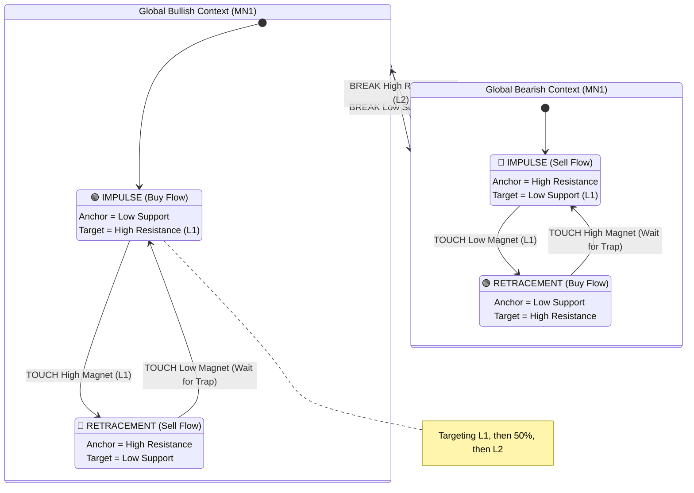

# Fractal Flow Architecture: The "Ping-Pong" Engine

## 1. Core Philosophy: The Infinite Game
The market is a ball bouncing between walls (Supply & Demand).
*   **Global Bias (MN1):** The "Arena". It tells us which wall is the "Goal" (Breakout) and which is the "Floor" (Safety).
*   **Local Flow (W1/D1):** The "Ball". It moves Impulse -> Retracement -> Impulse.
*   **Trigger:** **TOUCH (Raw Prive Action).** We do not wait for candles to close. We react to the wick.

## 2. The Logic Stack

### Level 1: MN1 (The Arena / Global Bias)
*   **Role:** Context & Persistence.
*   **Behavior:** It is SLOW to flip. It remains BULLISH even when we are selling a retracement.
*   **Example:**
    *   MN1 is **BULLISH**.
    *   Price hits a Major Sell Zone.
    *   MN1 remains **BULLISH**. (We know we are just taking a pitstop).

### Level 2: W1 (The Ball / Structure)
*   **Role:** The Quant Switch (Impulse vs. Retracement).
*   **Behavior:** Flips on **TOUCH**.
*   **Scenario (The Ping-Pong):**
    1.  **Impulse (Buy):** Anchored at Low. Target = Sell Zone (Magnet).
    2.  **EVENT:** Price **TOUCHES** Sell Zone L1.
    3.  **FLIP (Retracement):**
        *   Sell Zone L1 becomes **Active W1 Anchor**.
        *   Old Buy Zone becomes **Magnet**.
        *   **Flow:** SELL. (Counter-Trend).
    4.  **Target Reached:** Price hits Old Buy Zone.
    5.  **FLIP (Impulse):**
        *   System waits for **NEW BUY TRAP**.
        *   **Flow:** BUY. (Pro-Trend).
        *   **New Target:** Original Sell Zone (Deepening -> Midpoint or L2).

### Level 3: D1 (The Path)
*   **Role:** The Route.
*   **Behavior:** Align with W1. If W1 flips to Sell, D1 flips to Sell.

### Level 4: Execution (H4/H1/M30)
*   **Role:** The Sniper.
*   **Behavior:**
    *   Wait for **FRESH TRAP**.
    *   Trap Direction == W1 Flow.
    *   *Note:* In Retracement (Counter-Trend), we might require stricter confirmation (e.g., lower risk).

## 3. Visual Diagram (The Fractal State Machine)



## 4. Implementation Plan (Refactoring)

### Phase 1: Separate Concerns
We will split `StrategyOrchestrator.mqh` into clear logical blocks.

1.  **`AnalyzeNarrative()`** (The Generals)
    *   **Step 1: MN1 Bias.** (Is the Arena Green or Red?)
    *   **Step 2: W1 State.**
        *   Check for **Touch Events** (Current Price inside Magnet).
        *   If Touch -> **FLIP W1 Flow**.
        *   Else -> Maintain Flow.
    *   **Step 3: Define Target.** (Distance to Magnet).

2.  **`ScanExecution()`** (The Snipers)
    *   Read W1 Flow.
    *   Scan H4/H1/M30 for **Fresh Traps**.
    *   **Check:** Trap Direction == W1 Flow.
    *   **Check:** Trap Born Time > W1 Anchor Time.

### Phase 2: The "Touch" Logic
Update `FindLatestActiveAnchor` to include **Magnet Promotion**.
*   *Current Logic:* Look for existing zones behind price.
*   *New Logic:*
    *   Check MAGNETS first.
    *   Is Price INSIDE a Magnet? (L1-L2 range).
    *   Is Magnet Direction OPPOSITE to current flow?
    *   **YES:** Promote Magnet to **Active Anchor**.

---

## Changelog

### V1.1 - 2026-02-06: Fresh Trap + Any-Zone Flip

**Problem Identified:**
1. FLIP only triggered for the specifically tracked Magnet zone
2. If a NEW zone appeared (e.g., #150), it was ignored even if price entered it
3. Old traps (created BEFORE anchor touch) were being used

**Changes Implemented:**

| Component | Before | After |
|-----------|--------|-------|
| `CheckTouchFlip` | Only checked tracked `magnet_id` | Checks ALL valid opposing-direction zones |
| `FlowState` | No anchor touch tracking | Added `anchor_touch_time` field |
| `ClassifyFlow` | No touch detection | Detects when price enters Anchor L1-L2 range |
| `ScanTraps` | Accepted any trap | Only accepts traps where `zone_created_time > anchor_touch_time` |

**New Logs:**
- 🏀 `ANCHOR TOUCHED` - Price entered the Anchor zone, waiting for fresh traps
- 🎯 `FRESH TRAP FOUND` - Trap created AFTER anchor touch

**New Flow:**
```
1. Price in BULLISH flow, targeting BEARISH Magnet
2. Price enters ANY valid BEARISH zone (tracked Magnet OR new zone #150)
   └─> FLIP to BEARISH
3. Anchor touch time recorded
4. ONLY traps created AFTER that timestamp are valid
5. Fresh trap appears → Trade SELL
6. Price enters ANY valid BULLISH zone
   └─> FLIP to BULLISH
7. Repeat ping-pong
```

### V1.2 - 2026-02-06: Critical Flip Check Bug Fix

**Problem Identified:**
- `CheckTouchFlip` was inside the `if(m_is_dirty)` block
- `m_is_dirty` was set to `false` after the first tick and NEVER set back to `true`
- **Result:** Flip checks only ran ONCE on initialization, never again!

**Root Cause:**
```cpp
// OLD (BROKEN):
if(m_is_dirty)           // Only TRUE on first tick!
{
   CheckTouchFlip(...);  // Never runs after first tick!
   ClassifyFlow(...);
   m_is_dirty = false;   // Forever false after this
}
```

**Fix Applied:**
```cpp
// NEW (FIXED):
// Flip checks run EVERY tick
CheckTouchFlip(W1);
CheckTouchFlip(D1);

// Classification still throttled
if(m_is_dirty)
{
   ClassifyFlow(MN1);
   if(!flipped) ClassifyFlow(W1);
   if(!flipped) ClassifyFlow(D1);
   m_is_dirty = false;
}
```

**Impact:**
- Flip detection now works on every tick as intended
- Ping-pong between zones now functions correctly

### V1.3 - 2026-02-06: T-Touch Event-Driven Flip Optimization

**Problem Identified:**
- Checking for flips EVERY tick is wasteful
- 99%+ of ticks don't result in zone touches
- Unnecessary CPU cycles checking the same thing repeatedly

**Solution:**
Use the existing T1 touch tracking in `B2BZoneStatus.mqh` as an event trigger:

```cpp
// When W1/D1 zone gets T1 touched, signal the Orchestrator
if(zone.timeframe == PERIOD_W1 || zone.timeframe == PERIOD_D1)
   total_mask |= ZONE_CHANGE_HTF_TOUCHED;
```

**Call Chain:**
```
B2BZoneStatus.UpdateZoneStatusInBuffer  → Sets ZONE_CHANGE_HTF_TOUCHED
   ↓
Sigma_V5.0.mq5 OnTick                   → Passes change_mask
   ↓
TradeSignalGenerator.OnTick             → Passes change_mask
   ↓
StrategyOrchestrator.UpdateState        → Runs CheckTouchFlip ONLY if flag set
```

**Impact:**
- Flip checks only run when actually needed (W1/D1 zone touched)
- Significant performance improvement in high-frequency ticks
- Still runs on first tick (m_is_dirty = true) for initial classification

### V1.4 - 2026-02-06: Re-Entry Logic Fix & Debug Logging

**Problem Identified:**
- V1.3 `HTF_TOUCHED` gate was too aggressive.
- If price re-entered a *previously touched* zone, no event was fired.
- Result: Re-entry flips were missed.
- Also, classification didn't run on the same tick as a flip, causing state lag.

**Fix Applied:**
1. **Reverted Gate:** `CheckTouchFlip` now runs every tick again for W1/D1.
2. **Immediate Classification:** `if(m_is_dirty || w1_flipped || d1_flipped)` ensures state syncs immediately after a flip.
3. **Debug Logging:** Added `[FLIP]` messages specifically for the Tester.

**Impact:**
- Re-entry flips now detected correctly.
- State is perfectly synchronized.
- Flips are visible and verifiable in Strategy Tester logs.

### V1.5 - 2026-02-06: Anchor/Magnet Targeting in IsTradeAllowed

**Problem Identified:**
- `IsTradeAllowed` was using hardcoded D1-first fallback for anchor/magnet selection.
- If W1 authorized a trap, it still targeted the D1 magnet (which might not exist).

**Fix Applied:**
- `IsTradeAllowed` now uses `m_trap.parent_tf` to correctly select the authorizing timeframe's anchor/magnet.

### V1.6 - 2026-02-06: Dual-TF Authorization (W1 Independent Authorizer)

**Problem Identified:**
- W1 was treated as a **fallback** (only checked if D1 found nothing).
- User required W1 to have **equal standing** as an independent authorizer.

**Changes Implemented:**

| Component | Before | After |
|-----------|--------|-------|
| `TrapState` | No parent tracking | Added `parent_tf` field (D1 or W1) |
| `ScanTraps` | D1-first, W1-fallback | Both D1 and W1 hunt for traps in parallel |
| Logging | Generic trap log | Now shows `(D1 Auth)` or `(W1 Auth)` |

**New Flow:**
```
For each trap TF (H4 > H1 > M30):
   For each zone at that TF:
      → Can D1 authorize? (direction match, fresh, nested, price-in)
      → Can W1 authorize? (direction match, fresh, nested, price-in)
      → First match wins
```

### V1.7 - 2026-02-06: Nesting Logic Fix (REVERTED)

**Note:** The MathMax/MathMin approach was reverted after analysis showed the original direction-specific logic was correct.

**Conclusion:**
- L1 and L2 ARE consistently ordered based on direction:
  - BULLISH: L1 > L2 (entry above stop)
  - BEARISH: L1 < L2 (entry below stop)
- The original direction-specific nesting logic is mathematically correct.
- The perceived "bug" was actually a freshness or anchor persistence issue.

### V1.8 - 2026-02-06: Anchor State Persistence (Flip-Only Change)

**Problem Identified:**
- After a FLIP, `ClassifyFlow` would run on the next tick.
- `FindAnchor` might return a DIFFERENT zone (based on event time ranking).
- This would OVERRIDE the flip state, resetting `anchor_touch_time` to 0.
- **Result:** Trap authorization window closed immediately after flip!

**Root Cause:**
```cpp
// Old ClassifyFlow behavior:
if(out_flow.anchor_id != anchor.zone_id)
{
   out_flow.anchor_id = anchor.zone_id;
   out_flow.anchor_touch_time = 0; // ← Destroyed flip state!
}
```

**Fix Applied:**
```cpp
// V1.8: Preserve valid anchor state (only FLIP can change anchor)
if(out_flow.anchor_id > 0 && out_flow.anchor_touch_time > 0)
{
   // Verify anchor still valid, update magnet only
   // Return early - don't override with FindAnchor result
   return;
}
```

**New Behavior:**
| State | Before | After |
|-------|--------|-------|
| After FLIP | Could be overwritten by ClassifyFlow | Preserved until next FLIP |
| Anchor selection | `FindAnchor` runs every tick | Only runs when no valid anchor exists |
| Magnet selection | Updated every tick | Still updated every tick (targets can change) |

**Impact:**
- Anchor state now persists after price exits the flip zone.
- Trap authorization window stays open.
- Only a new FLIP (price entering opposing zone) changes the anchor.

